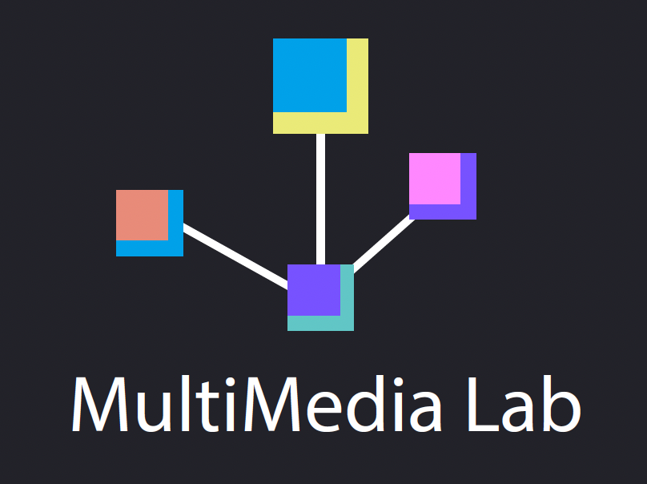

# 📘 Natural Language Processing (NLP) for Undergrads

### 👨‍🏫 Instructor: [Mehmet Can Yavuz, PhD](http://mehmetcanyavuz.com)

This repository contains a structured set of **learning packs** designed to introduce and deepen your understanding of **Natural Language Processing (NLP)**.  
The course blends **classical methods** with **modern deep learning approaches**, offering both **theoretical foundations** and **hands-on applications**.

---

## 📦 Course Modules

### **Pack 1 – Foundations of NLP**
- **Topics**: Introduction to NLP, Corpora, Words, Tokenization  
- **Applications**: Word comparison, dictionary use

---

### **Pack 2 – Statistical & Classical NLP**
- **Topics**:
  - Morphology & Finite-State Methods
  - Probabilistic Modeling; N-gram Language Models
  - Text Classification with Naive Bayes & Logistic Regression
  - Authorship Attribution, Sentiment Analysis, Fairness
- **Applications**: 
  - Text classification & evaluation

---

### **Pack 3 – Neural Networks**
- **Topics**:
  - Word Vectors
  - Neural Networks
  - Computational Graphs, Batching, Bias Analysis  
- **Applications**:
  - Vector Semantics & Word Embeddings
  - Feedforward & Convolutional Neural Networks

---

### **Pack 4 – Lexical Semantics & Structured Analysis**
- **Topics**: Lexical Semantics  
- **Applications**: WordNet, Syntactic Parsing

---

### **Pack 5 – Core NLP Tasks**
- **Topics**: Machine Translation (overview)  
- **Applications**: Part-of-Speech Tagging, Named Entity Recognition

---

### **Pack 6 – Deep Sequence Models**
- **Topics**: Recurrent Neural Networks (RNNs)  
- **Applications**: LSTMs & Attention (foundations)

---

### **Pack 7 – Large Language Models (LLMs)**
- **Topics**:
  - Transformers & Large Language Models (LLMs) overview
  - Prompt Engineering (zero-shot, few-shot)
- **Applications**:
  - Hugging Face Transformers & LLM practice notebooks

---

### **Pack 8 – Ethics in NLP**
- **Topics**: Bias, Exclusion, Risks & Ethical Concerns  

---

## 📈 Learning Path

1. **Start** with Pack 1 to build terminology and data handling skills.  
2. **Add probabilistic intuition** in Pack 2 (language modeling & classical classifiers).  
3. **Learn neural basics** in Pack 3 (embeddings, MLP/CNN, training dynamics).  
4. **Explore semantics/structure** in Pack 4 (lexicons, WordNet, parsing primer).  
5. **Apply to core tasks** in Pack 5 (POS, NER; MT overview).  
6. **Master sequences** in Pack 6 (RNN → LSTM → attention intuition).  
7. **Scale up** in Pack 7 (Transformers, LLMs, prompting, HF pipelines).  
8. **Reflect responsibly** in Pack 8 (bias, fairness, safety, reproducibility).

> 💡 Recommended pacing: ~1 pack/week with labs. Integrate a **term project** spanning Packs 2–7.

---

## 🎯 Learning Outcomes

By the end of the course, students will be able to:

- **Explain** key NLP concepts (tokenization, morphology, semantics, syntax).  
- **Build** classical models (n-grams, Naive Bayes, Logistic Regression) and **evaluate** them with proper metrics.  
- **Train** neural models for NLP tasks; **use** embeddings and understand optimization/batching.  
- **Implement** sequence models (RNN/LSTM) and **reason** about attention at a high level.  
- **Use** modern tooling (Hugging Face Transformers) for downstream tasks with prompting/fine-tuning.  
- **Assess** datasets/models for bias, fairness, and ethical risks; **document** models with concise reports.
