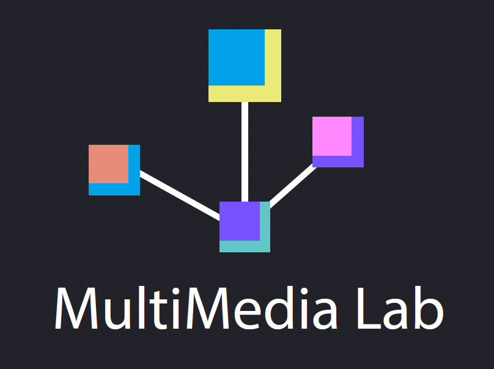
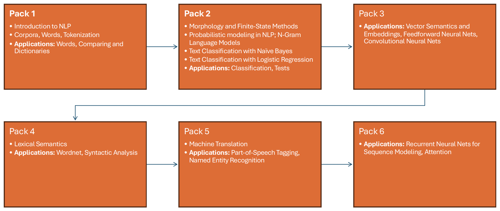
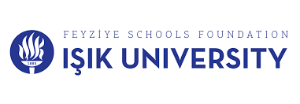

# 📘 Natural Language Processing (NLP) for Undergrads

### 👤 Instructor: Mehmet Can Yavuz, PhD — [mehmetcanyavuz.com](http://mehmetcanyavuz.com)

This repository contains a structured set of **six learning packs** designed to introduce and deepen your understanding of Natural Language Processing (NLP).  
The course balances **classical approaches** with **modern neural methods**, combining theory with hands-on applications.  

---

## 📦 Pack 1 – Foundations of NLP
- **Topics**
  - Introduction to NLP
  - Corpora, Words, Tokenization
- **Applications**
  - Words, Comparing Words, Dictionaries

---

## 📦 Pack 2 – Statistical & Classical NLP
- **Topics**
  - Morphology and Finite-State Methods
  - Probabilistic Modeling in NLP; N-Gram Language Models
  - Text Classification with Naive Bayes
  - Text Classification with Logistic Regression
- **Applications**
  - Classification, Tests

---

## 📦 Pack 3 – Neural Nets
- **Applications**
  - Vector Semantics and Embeddings  
  - Feedforward Neural Networks  
  - Convolutional Neural Networks

---

## 📦 Pack 4 – Lexical Semantics & Structured Linguistic Analysis
- **Topics**
  - Lexical Semantics
- **Applications**
  - WordNet  
  - Syntactic Analysis

---

## 📦 Pack 5 – Core NLP Tasks
- **Topics**
  - Machine Translation
- **Applications**
  - Part-of-Speech Tagging  
  - Named Entity Recognition

---

## 📦 Pack 6 – Deep Sequence Models
- **Applications**
  - Recurrent Neural Networks for Sequence Modeling  
  - Attention Mechanisms
- **Overview of LLMs**

---

## 📈 Learning Path
1. **Text Basics** → Words, corpora, tokenization  
2. **Statistical Models** → N-grams, classification (Naive Bayes, Logistic Regression)  
3. **Semantics & Neural Nets** → Embeddings, CNNs  
4. **Structured Analysis** → Syntax, WordNet  
5. **Core NLP Tasks** → POS tagging, NER, Translation  
6. **Advanced Deep Learning** → RNNs, Attention, LLMs

---

## 🎯 Outcomes
By the end of this course, you will be able to:
- Preprocess and represent text for NLP tasks  
- Apply statistical and classical NLP methods  
- Use embeddings and neural models for semantics  
- Perform syntactic and lexical analysis  
- Build models for tagging, NER, and machine translation  
- Implement sequence models with attention  

## ⚖️ License
This course is released under the [MIT License](LICENSE).  
It is adapted and customized from [Berkeley Info 256 Applied Natural Language Processing 2019](https://github.com/dbamman/anlp19) by David Bamman and [CS447 Natural Language Processing](https://courses.grainger.illinois.edu/cs447/sp2023/index.html) by Julia Hockenmaier

